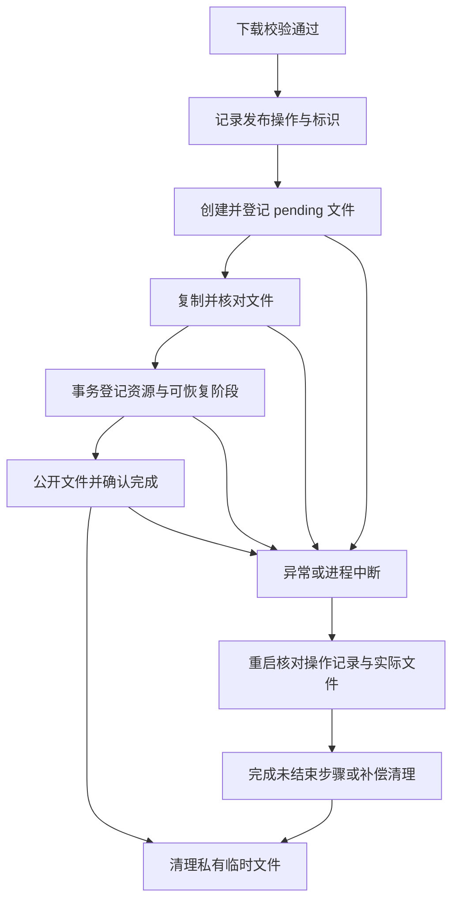
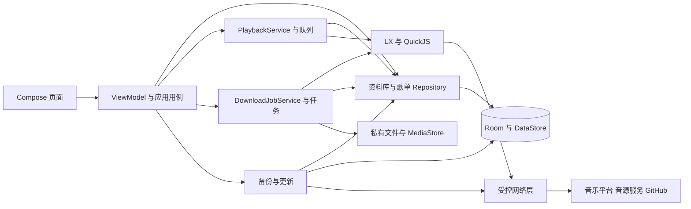

# 拾音 PickAudio 项目优化审查与实施建议

审查日期：2026-10-06（Asia/Shanghai）

审查版本：v1.2.0，versionCode 9

源码基线：4e5da8e4d3d8938a6df0fff4b0a77da0871cac53

文档性质：源码基线4e5da8e的审查记录、优化计划和验收依据。问题描述及初轮测量对应当时源码；本轮实际修改、当前状态和测试结果统一记录于[优化执行与验收记录](OPTIMIZATION-EXECUTION.md)。

## 1. 审查结论

项目已经具备较完整的日常使用功能：本地导入、独立平台搜索、歌单与队列整理、播放错误恢复、歌词、断点下载、备份和升级均已有实现。v1.2.0 已处理搜索旧请求覆盖、REPLACE 引发关联删除、小屏大字号布局等问题，这些成果应作为下一轮的回归基线。

下一轮最有价值的方向是补齐操作与状态的一致性：用户点击取消就真正停止任务，系统媒体控制与应用队列一致，删除、恢复和下载发布遇到中断仍能恢复正确结果。随后解决大曲库查询、界面重复订阅和包体积，再扩展播放功能。

建议首先处理 O01、O03、O05、O06、O07、O11、O12。其中，更新取消失效、重复歌曲选错队列位置、JNI 引用未释放、备份导出与导入限制不对称，都可以直接从代码确认；设备上的实际表现及严重程度仍需对应复验。

包体积也值得单独安排：现有正式 APK 为 54,403,842 字节，约 51.9 MiB；其 DEX 条目合计约 48.11 MiB，约占整包 93%。Release 关闭代码裁剪，优先评估 R8 和图标依赖有明确依据。

### 1.1 证据与验证边界

本轮检查了应用入口、Compose 页面与组件、Room 实体和 DAO、资料库与歌单、Media3 播放、下载调度及发布、LX/QuickJS 桥接、在线适配器、歌词、备份、更新和构建配置，并对照既有测试及升级记录。

| 验证项 | 本轮实际结果 |
|---|---|
| Debug JVM 单元测试 | 29 项，0 失败，0 错误 |
| Android Lint | 0 错误、56 条警告 |
| 执行命令 | :app:testDebugUnitTest :app:lintDebug --console=plain --rerun-tasks |
| 正式 APK 构成 | 读取现有 v1.2.0 APK 的 ZIP 条目；未重新打包 |
| Android 设备 | adb 当前没有连接设备；本轮未执行设备、蓝牙、锁屏或长时播放测试 |
| 既有设备验收 | 见 UX-UPGRADE.md，属于之前的验收记录 |
| 性能结论 | 尚未测量启动耗时、帧率、耗电、网络流量和峰值内存；本文对应数值均为建议目标 |

测试报告位于 app/build/reports/tests/testDebugUnitTest/index.html，静态报告位于 app/build/reports/lint-results-debug.html。上述统计属于初轮审查；本地报告会被后续构建更新，最新结果以优化执行记录为准。

证据标记：

- A：代码或配置直接确认。确认的是当前实现事实，不表示已在手机上复现所有影响。
- B：存在具体中断、竞态或设备场景，需要定向复验。
- C：产品与工程优化建议，需要按使用范围和投入选择。

优先级：P1 为核心行为与数据可靠性，优先进入下一轮；P2 为性能、易用性和维护成本；P3 为可选功能或支持范围扩展。本轮没有认定已经发生的 P0 事故。

### 1.2 优化清单

工作量表示单项相对规模：S 为局部修改，M 为跨文件调整，L 为涉及迁移或多个子系统。应在复验和方案拆分后估时。

| 编号 | 优化项 | 优先级 | 证据 | 规模 |
|---|---|---|---|---|
| O01 | 更新下载真正可取消，防止旧任务回写状态 | P1 | A | S–M |
| O02 | 安装包完整性、身份与路径校验 | P1 | A/B | M |
| O03 | 系统媒体会话与应用队列、播放模式统一 | P1 | A/B | L |
| O04 | 队列条目身份与播放快照完整恢复 | P1 | A/B | M–L |
| O05 | 导入、删除及关联数据操作保持一致 | P1 | A/B | M |
| O06 | 下载任务使用明确、可串行化的状态转换 | P1 | A/B | M |
| O07 | 公共文件发布可恢复，覆盖进程中断窗口 | P1 | A/B | M–L |
| O08 | 已完成下载与文件实际可用性一致 | P1 | A/B | S–M |
| O09 | 网络取消、响应限制和资源释放统一 | P1 | A/B | M |
| O10 | 脚本网络边界及正式版 TLS 策略收敛 | P1 | A/B | M |
| O11 | QuickJS 引用、异常及运行时生命周期完善 | P1 | A/B | M |
| O12 | 备份可往返恢复，完善跨存储一致性 | P1 | A/B | M–L |
| O13 | 播放与下载使用同一音质事实模型 | P2 | A/B | M |
| O14 | 大曲库查询、稳定 Flow 与界面重组优化 | P2 | A/B | M–L |
| O15 | 目录扫描提速，补齐文件与分类信息 | P2 | A/B | M |
| O16 | 歌词刷新范围、解析兼容性及校准保存 | P2 | A/B | S–M |
| O17 | 搜索的来源可达性与分页结束条件 | P2 | A/C | S–M |
| O18 | 批量操作反馈、撤销和排序一致性 | P2 | A/B | M |
| O19 | 持久化待修复列表，改善文件重新关联 | P2 | A/C | M |
| O20 | 生命周期、睡眠定时、返回行为与无障碍 | P2 | A/B/C | M |
| O21 | 缓存身份、容量与播放性能观测 | P2 | A/B/C | M |
| O22 | 正式包代码裁剪与依赖精简 | P2 | A | M |
| O23 | 测试覆盖真实业务实现与关键故障 | P2 | A | M–L |
| O24 | 数据库 schema、CI、发布与第三方信息治理 | P2 | A/C | M |
| O25 | 按目标用户评估 Android 支持范围 | P3 | A/C | L |
| O26 | 分阶段增加连续播放与曲库增强功能 | P3 | C | M–L |

## 2. 核心可靠性优化

### O01：更新下载真正可取消

依据：[AppUpdateManager.kt](../app/src/main/java/com/pickaudio/update/AppUpdateManager.kt)，L80、L202、L244、L272。

downloadJob 声明后没有获得任何任务赋值，取消按钮仅取消这个空引用并将界面状态改为 Idle。下载实际在调用方协程中执行，阻塞的 HTTP 请求与读取循环没有相应取消检查或 Call.cancel() 绑定。因此，点击取消没有建立停止下载的机制，旧下载仍有机会发布 Downloaded 状态。SettingsScreen 发起下载的协程还与页面生命周期绑定，退出页面后的行为需要明确。

建议让更新管理器持有实际下载任务及网络 Call；取消时停止两者，循环检查取消，流通过 use 释放；使用任务代次阻止旧任务回写。将退出页面后继续下载或停止下载设为一致的产品行为。

验收：慢速服务器下下载到 30% 后取消，连接停止，临时文件按策略处理，等待原预计完成时间后界面仍保持取消结果；立即重新下载不会被前一次任务覆盖。

### O02：安装前校验完整性、应用身份与文件路径

依据：[AppUpdateManager.kt](../app/src/main/java/com/pickaudio/update/AppUpdateManager.kt)，L202、L282；[version.json](../version.json)；[file_paths.xml](../app/src/main/res/xml/file_paths.xml)。

更新清单缺少机器可读的摘要字段，下载完成未核对清单大小、SHA-256、包名、签名证书和 APK 内部版本。远端 versionName 被直接用于本地文件名，没有限定为安全的版本标识。FileProvider 目前开放整个缓存和外部私有目录，实际更新文件位于 cache/updates。

建议在清单中提供摘要并读取可用的 Release 资源摘要；下载到固定目录的临时文件，限制大小，校验后原子改名。安装前比对包名、签名历史及实际 versionCode，避免错误渠道或旧安装包进入安装流程。文件名使用内部生成的标识，FileProvider 缩小到实际共享目录。更新元数据使用可信 HTTPS 来源，必要时再引入签名清单。

Android 安装器仍会对覆盖安装执行签名校验；本文没有认定未经本机签名验证的 APK 能覆盖当前应用。前置校验的价值是提早识别错误文件、明确报错并缩小共享范围。

验收：截断包、错误摘要、其他包名、旧版本、错误签名和异常版本字符串都在进入安装器前被拒绝；正确原签名包可以覆盖安装。

### O03：系统媒体会话与应用队列统一

依据：[PlaybackService.kt](../app/src/main/java/com/pickaudio/playback/PlaybackService.kt)，L31；[PlaybackCoordinator.kt](../app/src/main/java/com/pickaudio/playback/PlaybackCoordinator.kt)，L528、L626。

应用通过 PlaybackCoordinator 管理队列、上一首、下一首和随机顺序，但 ExoPlayer 每次只 setMediaItem 当前歌曲；MediaSession 又直接绑定这个 ExoPlayer，没有将标准媒体命令接入协调器。系统看到的时间线与应用队列存在结构性差异，通知、锁屏、蓝牙和其他控制端的切歌能力及行为需要优先复验。

可选择两种方案：近期通过具有完整命令与时间线语义的 Player 适配层，将媒体命令路由到现有队列；长期让 Media3 持有完整队列并在需要时解析歌曲地址。前者较快保留现有解析逻辑，后者更利于连续播放，但在线地址过期、跨平台候选确认和错误跳过都要一起设计。

补齐通知点击进入播放器的 PendingIntent，明确控制端可用命令；导出的媒体服务本身是正常集成方式，不应直接通过禁止外部连接来处理 Lint 警告。

验收：应用、通知、锁屏、蓝牙四种入口的播放、暂停、上一首、下一首一致；顺序末尾、单曲循环、随机模式和候选版本确认均有预期结果。

### O04：队列条目拥有独立身份，快照完整恢复

依据：[PlayerScreen.kt](../app/src/main/java/com/pickaudio/ui/screens/PlayerScreen.kt)，L191；[PlaybackCoordinator.kt](../app/src/main/java/com/pickaudio/playback/PlaybackCoordinator.kt)，L425、L727、L756；[QueueBottomSheet.kt](../app/src/main/java/com/pickaudio/ui/components/QueueBottomSheet.kt)，L34；[Entities.kt](../app/src/main/java/com/pickaudio/data/db/Entities.kt)。

队列允许同一首歌出现多次，但点击队列项时最终调用 addOrPlayTrack，通过 track.id 的 indexOfFirst 定位，会选到第一处同歌曲条目。快照也只保存 currentTrackId，重启后无法区分重复歌曲的具体位置。队列显示键通过前缀计数生成，构建全部条目的代价随队列长度增长。

恢复时手动构造 Track，未补齐在线引用与来源信息；播放模式只恢复到 StateFlow，未同步设置播放器 repeatMode；保存的随机历史没有读取，随机池也未完整保存。保存快照独立启动 IO 协程，与队列写入不在同一串行序列，存在旧快照覆盖新状态或清空后再写入的窗口。

建议使用持久化 queueEntryId 区分歌曲与队列条目，快照保存当前条目及队列版本；按条目播放和排序。复用统一 Track 映射，恢复模式、元信息和随机状态；通过单一写入序列保存队列与快照，合并高频进度写入。

验收：队列 A、B、A 中点击最后一个 A，位置准确；重启后仍停在这个条目。在线歌曲来源和歌词正确，单曲循环保持，随机上一首沿历史返回，清空后重启不恢复旧队列。

### O05：导入、删除与关联数据操作保持一致

依据：[LibraryRepository.kt](../app/src/main/java/com/pickaudio/data/repository/LibraryRepository.kt)，L135、L229、L329；[LibraryScreen.kt](../app/src/main/java/com/pickaudio/ui/screens/LibraryScreen.kt)，删除确认逻辑。

导入时歌曲与文件资源分两次写入，没有共同事务。删除时多张表逐步清理后删除歌曲，也没有事务；文件删除异常及失败结果被忽略，随后仍移除记录并可能返回 true。UI 无法区分“歌曲记录移除成功”和“音频文件确实删除”。删除下载记录也没有先协调同歌曲的运行中下载。

建议每首导入的歌曲与资源一起提交。数据库层删除采用事务；物理文件操作单独记录结果，返回结构化的删除报告，保留失败文件的处理入口。先取消并等待相关下载退出，再移除关联。核对外键已有级联行为，减少多处重复维护的清理清单。

文件系统与 Room 无法通过一个数据库事务同时提交；需要操作阶段记录或补偿，明确中断后重试哪个步骤。

验收：在导入和删除的各个写入点注入异常，不产生半份关联；没有删除权限时明确报告保留了哪些文件；边下载边移除歌曲不产生新公开文件、残余任务或缺失外键引用。

### O06：下载状态转换可串行化

依据：[DownloadCoordinator.kt](../app/src/main/java/com/pickaudio/download/DownloadCoordinator.kt)，L64、L83、L124、L142、L148；[DownloadJobService.kt](../app/src/main/java/com/pickaudio/download/DownloadJobService.kt)，L45。

当前通过 running、jobs、数据库字符串状态分别决定调度。暂停立即移出 jobs，而旧协程清理及 PAUSED 写入随后执行；立即继续时旧任务可能回写状态。等待信号量的任务还没有进入 executeDownload，取消后的处理与运行中任务不同。

具体需要复验的窗口：runPending 已读到空队列、尚未将 running 置为 false 时新增任务，schedule 因 running 为 true 返回，新增任务可能没有执行者。系统停止任务时 onStopJob 返回 false，排队任务的状态与后续调度也要核对。并发 enqueue 的查询和插入未统一保护，唯一索引应当作为最后防线，而不是正常流程中的竞争处理方式。

建议把调度、认领、暂停、继续、取消作为串行命令处理；使用受条件约束的数据库状态转换及执行代次，旧执行者仅能更新自己的代次。运行器退出前再次确认待处理任务，等待退出后再允许同任务启动新执行者。明确系统停止、网络丢失、用户暂停三种恢复政策。

验收：快速暂停／继续 20 次，没有状态回退和双执行；第三个等待任务可暂停；在运行器退出点新增任务仍启动；网络中断和系统停止后任务均有明确的继续入口。

### O07：公共文件发布具有中断恢复协议

依据：[DownloadCoordinator.kt](../app/src/main/java/com/pickaudio/download/DownloadCoordinator.kt)，L97、L253、L295。

publish 创建 MediaStore 文件并清除 IS_PENDING 后，调用方才提交 LocalAsset 和 COMPLETED。若公开成功后数据库提交失败，文件可能已可见，而任务仍未完成；重启恢复又按 PUBLISHING 状态删除 targetUri。MediaStore 插入成功到 targetUri 写入之间也存在未登记文件的中断窗口。普通异常路径没有覆盖所有发布后失败情形。

建议为每次发布保存可识别的 publishToken、目标 URI、文件规格和阶段。复制后确认字节数，先提交可恢复的发布记录，再解除 pending；完成确认后清理临时文件。启动时核对文件与数据库，完成未结束的提交或清理未成功的输出；重复执行同一发布操作不得生成第二份文件。

存储预算应包含临时文件和公共文件同时存在的空间，两个并发任务应共同预留预算；目前可用空间检查主要覆盖下载阶段，发布再复制的成本尚需实测。

验收：在创建、复制、记录提交、公开、完成提交各阶段中断进程，重启后只保留一份正确文件，任务与曲库一致；低空间失败留下可解释、可继续的状态。

### O08：已完成下载与实际文件一致

依据：[DownloadCoordinator.kt](../app/src/main/java/com/pickaudio/download/DownloadCoordinator.kt)，L64、L321；[DownloadScreen.kt](../app/src/main/java/com/pickaudio/ui/screens/DownloadScreen.kt)。

同平台歌曲同音质已有 COMPLETED 任务时，enqueueDownload 直接返回旧任务编号，没有检测 targetUri。用户在系统文件管理器中删除歌曲后，重新下载可能仍被当作已完成。删除下载文件时若 ContentResolver 返回 0，又提前返回 false，旧完成记录可能无法通过该入口清理。

建议在完成任务播放、查看和重新下载时检查 URI；区分文件丢失、权限失效和真正存在。丢失时提供重新下载与重新关联，将旧完成记录转为可修复状态。删除任务记录和删除文件分别返回结果。

验收：通过系统文件管理器删除完成歌曲后，可在原条目重新下载；无重复任务、无假完成状态；权限失效时不会误删仍存在的文件。

### O09：网络取消、读取上限与资源释放统一

依据：[NetEaseSearchAdapter.kt](../app/src/main/java/com/pickaudio/online/NetEaseSearchAdapter.kt)、[QqMusicSearchAdapter.kt](../app/src/main/java/com/pickaudio/online/QqMusicSearchAdapter.kt)；[LxSourceManager.kt](../app/src/main/java/com/pickaudio/source/LxSourceManager.kt)，L187、L318、L484。

搜索管理器已有代次保护，可以避免旧结果覆盖；但适配器的阻塞 execute 没有绑定协程取消，旧请求仍可能占用网络。多个源请求未使用 response.use，尤其 HTTP 失败分支需要保证关闭响应。

脚本链接先 body.string() 再检查 5 MiB，脚本网络响应先 body.bytes() 再检查 8 MiB；限制发生在完整分配之后，不能有效约束峰值内存。QuickJS 的 64 MiB 限额仅限制 JS 堆，不覆盖这些 Kotlin 字节数组。脚本发起的网络任务使用管理器长期 scope，与某次解析的取消生命周期分离。

建议统一可取消的网络适配器，绑定 Call.cancel()；所有响应通过 use 释放，按实际读取累计上限，Content-Length 作为提前拒绝的辅助条件。按源限制宿主请求并发、队列和总预算，解析结束或超时后撤销关联请求；明确连接、读取和整次调用超时。

验收：切换关键词后旧请求关闭；超限分块响应不会完整进入内存；连续取消和 HTTP 失败没有响应泄漏；脚本解析超时后关联请求停止。

### O10：脚本网络边界与正式版 TLS 策略收敛

依据：[LxSourceManager.kt](../app/src/main/java/com/pickaudio/source/LxSourceManager.kt)，L323、L455；[network_security_config.xml](../app/src/main/res/xml/network_security_config.xml)；RepositoryIntegrationTest 中本地返回地址夹具。

脚本 lx.request 对原始主机进行一次独立 DNS 检查，但实际 OkHttp 连接使用自己的解析并自动重定向；返回的播放 URL 只检查 http/https 前缀，随后由播放器或下载器访问，不经过相同地址策略。现有测试甚至直接使用脚本返回的 127.0.0.1 音频地址，说明两条路径确实不同。远端脚本导入也未复用同样的地址检查。

正式网络配置允许所有域名明文流量，并信任用户安装证书，Lint 对这两项均有提示。部分源可能需要 HTTP，收紧策略前应验证兼容情况。

建议统一脚本导入、宿主请求及解析结果的 URL 策略，检查实际连接所用地址集合与每次重定向，覆盖 IPv4/IPv6、回环、私网、链路本地和异常 scheme。Release 默认使用系统证书；调试证书放入 debug-overrides。HTTP 兼容线路按实际需要配置，并向使用者说明兼容选项的影响。

验收：私网目标、公共地址跳转私网、多地址解析和返回私网音频地址均按政策处理；正式包对更新链路保持可信 HTTPS；正常脚本仍可使用。网络测试夹具通过测试注入放行，不改变正式策略。

### O11：QuickJS 引用、异常与生命周期完善

依据：[quickjs_jni.c](../app/src/main/cpp/quickjs_jni.c)，L122、L150、L374、L409、L415；[QuickJsEngine.kt](../app/src/main/java/com/pickaudio/source/QuickJsEngine.kt)；[LxSourceManager.kt](../app/src/main/java/com/pickaudio/source/LxSourceManager.kt)。

js_lx_request 从全局对象读取 callbacks 后，在常规路径没有对应 JS_FreeValue；这是直接可见的引用释放遗漏。请求完成只将属性设置为 undefined，没有删除请求编号属性，长时使用会保留不断增长的键集合。JS_Call 及 JS_ExecutePendingJob 的异常结果没有转换为清楚的宿主错误，部分脚本失败可能最终表现为解析超时。

建议逐项审计 JSValue 所有权和 JNI 引用，真正删除结束的回调键；捕获 JS 异常并关联请求。跨运行时请求编号采用安全的生成方式；保留现有引擎串行访问锁、执行时间和内存限制。源切换、删除、并发解析与超时需要统一生命周期，闲置引擎设数量上限或回收策略。

验收：执行 1,000 次宿主请求后内存趋于稳定、回调表不持续增长；反复导入、测试、关闭没有 native 崩溃；JS 同步及异步异常及时显示实际原因；超时与关闭不会调用已经释放的运行时。本轮没有执行 native 泄漏或崩溃复现。

### O12：备份可往返恢复，完善跨存储一致性

依据：[BackupManager.kt](../app/src/main/java/com/pickaudio/backup/BackupManager.kt)，L21、L33、L61、L87、L137。

导入限制解压后的总内容不超过 16 MiB，导出没有同样限制。因此，歌词较多时能够导出当前程序自己拒绝恢复的文件。完整清单和歌词一次进入内存，也增加大备份的峰值内存与长事务时间。

恢复在 Room 事务内调用 DataStore 保存偏好，异常时再补偿回滚偏好；普通异常已有处理，但进程在 DataStore 成功、Room 提交前终止时，两个存储无法一起回滚。需设计可恢复的恢复会话或按阶段完成并报告结果。

建议统一导出与导入的容量契约；短期超限导出应明确失败，保留已有备份，长期采用分片清单和独立歌词条目。校验所有集合、字段、唯一编号及引用后再写库，覆盖恶意或损坏的 JSON。在线引用当前写入空 metadata，搜索模型及备份也未保留平台详细信息；若要支持更广泛 LX 脚本，应将平台元信息纳入有版本的契约。

下一版备份可补充封面地址、添加时间、文件名／大小／指纹及原文件夹信息，方便跨设备匹配；仍需向用户清楚说明音频和脚本的实际备份范围。重复恢复收藏会重新写入 addedAt，宜明确是否保留本机收藏顺序。

验收：新导出的备份总能被同版本导入；在恢复不同阶段中断，重启后显示并完成恢复会话；旧 v1/v2 备份继续可读；大备份、空值、重复编号、校验错误和冲突引用均有清楚结果。

## 3. 性能与日常体验打磨

### O13：播放与下载使用同一音质事实模型

依据：[PlaybackCoordinator.kt](../app/src/main/java/com/pickaudio/playback/PlaybackCoordinator.kt)，L156、L176、L661；[AudioFormatProbe.kt](../app/src/main/java/com/pickaudio/download/AudioFormatProbe.kt)；[PlayerScreen.kt](../app/src/main/java/com/pickaudio/ui/screens/PlayerScreen.kt)，音质选择逻辑。

下载已经检测 FLAC 位深，而播放侧只按 MIME 拒绝非 FLAC，选择 flac24bit 时没有验证 24bit。格式探测将 RIFF/WAVE 一律标为无损、MP4 容器一律标为有损，未解析实际编码；MediaMetadataRetriever 能读出时长，也不等同于整首文件都能正常解码。

建议统一 AudioInfo，保存容器、编码、位深、采样率、声道、码率及检测可信度。用户请求规格、源声明能力、实际文件信息分别表示；无法确认规格时显示“未验证”，出现 320K→128K 等降档时明确提示。多份本地资源按可用性及目标音质选择，避免始终使用 DAO 返回的第一份文件。

播放音质窗口应与当前源能力一致；切换音质保留进度和暂停状态，明确本次播放与默认设置的影响。验收覆盖 16/24bit FLAC、AAC、PCM/压缩 WAV、ALAC、实际降档及截断文件。

### O14：大曲库查询与界面订阅优化

依据：[LibraryRepository.kt](../app/src/main/java/com/pickaudio/data/repository/LibraryRepository.kt)，L119；[PlaylistRepository.kt](../app/src/main/java/com/pickaudio/data/repository/PlaylistRepository.kt)，L16、L118；[LibraryScreen.kt](../app/src/main/java/com/pickaudio/ui/screens/LibraryScreen.kt)，L46、L93；[MainActivity.kt](../app/src/main/java/com/pickaudio/MainActivity.kt)，L77。

资料库和歌单通过组合全表 Flow 构造所有 Track；单个歌单和收藏页也依赖整库映射。页面重组时直接调用 getAllTracks/getPlaylistSummaries 等工厂会生成新 Flow，可能反复重启订阅。下载每 500ms 写进度可使曲库中的下载统计更新；分组和排序又在组合过程中执行。播放进度在主导航层订阅，扩大了需要检查的重组范围。

建议先固定页面 Flow，使用 ViewModel 的 StateFlow 与 collectAsStateWithLifecycle；把高频进度订阅下沉到 MiniPlayer、进度条和歌词。用 Room 投影查询歌单成员、统计与来源，批量获取资源；把排序和分组移到后台，给搜索输入增加短防抖。大曲库再引入 Paging／FTS，并核对索引与查询计划。

验收：1,000／10,000 首曲库下记录启动、筛选、滚动与下载时的 SQL 次数、重组和帧耗时。修改一首收藏不应触发多个页面重复整库订阅；目标值须根据基准设备确认。

### O15：扫描提速并补齐资料库信息

依据：[LibraryRepository.kt](../app/src/main/java/com/pickaudio/data/repository/LibraryRepository.kt)，L47、L191、L229、L315；[LibraryScreen.kt](../app/src/main/java/com/pickaudio/ui/screens/LibraryScreen.kt)，分组逻辑。

递归目录导入对每首歌曲通过 parent.findFile 查找歌词，DocumentFile 常需再次列举目录，大目录可能出现重复查询。MediaMetadataRetriever.release 没有置于 finally，损坏文件抛错时可能漏释放。SAF 文件资源大小固定为 0，也未提取内嵌封面。

重新扫描已导入歌曲主要更新 available=true，没有刷新标签或系统性处理已移走文件。身份将 MediaStore 音频归一为末尾 ID，需要针对多卷场景核查冲突。SAF 分类只保存父目录名称，两个同名目录会合并；专辑按名称分组，也会合并不同歌手的同名专辑。

建议每个目录一次列举建立歌曲／歌词索引，用队列式遍历处理深目录；MMR 始终 finally 释放，批量提交进度。补齐文件大小、完整目录标识、卷信息和可选嵌入封面缓存。扫描成功完成后对授权范围内的缺失资源做状态核对，避免将没有权限误当作文件删除。

验收：同名文件夹和专辑可区分；标签修改和文件移动后状态更新；取消、损坏音频和多卷导入结果准确；大目录的提供者查询次数随文件数近似线性增长。

### O16：歌词刷新只作用于目标歌曲

依据：[PlayerScreen.kt](../app/src/main/java/com/pickaudio/ui/screens/PlayerScreen.kt)，L66、L85；[LyricRepository.kt](../app/src/main/java/com/pickaudio/data/repository/LyricRepository.kt)；[LyricParser.kt](../app/src/main/java/com/pickaudio/online/LyricParser.kt)。

retryLyrics 不按歌曲重置，一次重试后，其后的歌曲都会以 refresh=true 加载在线歌词，从而绕过已有在线缓存。解析目前限定两位分钟／秒和两至三位小数，没有处理 LRC 的 offset 元数据；歌词接口未统一检查 HTTP 和业务状态，无歌词与请求失败容易混淆。

建议为每首歌建立刷新请求，成功后消费；保留手动歌词优先级。扩展常见时间格式与 offset 的明确定义，原文／翻译匹配使用有序合并，校准变更合并写入。刷新失败时允许显示已有缓存并说明状态。

验收：A 重试后切到 B，B 可使用缓存；GB18030、BOM、多时间戳、长分钟和内嵌 offset 解析符合约定；断网刷新仍能阅读缓存，校准重启后保持。

### O17：所有来源的搜索结果都容易到达

依据：[SearchScreen.kt](../app/src/main/java/com/pickaudio/ui/screens/SearchScreen.kt)；[SearchStateManager.kt](../app/src/main/java/com/pickaudio/ui/screens/SearchStateManager.kt)；两个在线搜索适配器。

“全部”把网易云整个分页列表放在 QQ 前方，不断加载网易云会把 QQ 结果推得更远。hasMore 仅根据返回条数是否达到 20 判断，连续返回重复满页时仍可能一直显示加载更多。分页大小在管理器和适配器之间也存在隐式约定。

建议保留独立平台状态，增加来源锚点／快捷切换，或先展示各来源摘要再展开。搜索返回统一 SearchPage，包含总量或下一页标识；连续无新增内容时停止，并保留页级重试。离线、超时、服务拒绝和无结果使用不同提示。

验收：QQ 结果无需经过逐渐增长的网易云列表；重复页不会无限加载；一方故障不隐藏另一方，既有搜索竞态测试继续通过。

### O18：批量操作报告真实结果，撤销恢复原位置

依据：[MusicActions.kt](../app/src/main/java/com/pickaudio/ui/components/MusicActions.kt)；[PlaylistDetailScreen.kt](../app/src/main/java/com/pickaudio/ui/screens/PlaylistDetailScreen.kt)，L48；[PlaylistRepository.kt](../app/src/main/java/com/pickaudio/data/repository/PlaylistRepository.kt)，L75、L98。

批量下载逐首 enqueue，前几首成功后下一首失败，只显示总体错误；用户无法知道已加入哪些歌曲。歌单移除的撤销调用 addTracks，歌曲会追加到末尾，原顺序不能恢复。批量加入歌单对每首歌曲重新读取成员列表与最大排序值，也有优化空间。收藏排序借用 addedAt，失去真实收藏时间。

建议批量命令返回新增、已存在、失败、跳过的统计与失败项；重试只作用于失败项。撤销保存原条目位置和时间信息；成员列表一次读取后批量写入。排序增加独立 order 字段，拖动时提供保存失败反馈。

验收：100 首中 3 首失败时准确报告 97/3，重试不重复成功项；移除中间歌曲后撤销保持原顺序；收藏排序不改变真实时间。

### O19：待修复文件成为持久化入口

依据：[SettingsScreen.kt](../app/src/main/java/com/pickaudio/ui/screens/SettingsScreen.kt)，恢复结果窗口；[LibraryRepository.kt](../app/src/main/java/com/pickaudio/data/repository/LibraryRepository.kt)，L79。

恢复后的待关联列表只保存在页面的 report 状态，关闭窗口或重启后无法从这个列表继续处理。选择已经导入的文件时，relinkTrack 合并到另一首歌曲并删除原记录；歌单顺序、在线引用和全部队列条目的语义需要一起考虑。

建议在曲库增加“待关联／权限失效”入口，从实际资源状态派生；提供目录授权和批量候选匹配，人工确认后关联。保留稳定歌曲编号；确实要合并两首歌曲时先展示差异，并保留成员顺序、收藏、歌词和引用。缺少文件指纹时不凭同名歌曲静默合并。

验收：恢复后关闭页面、重启仍能继续修复；同名不同录音不会误关联；合并或关联后所有歌单、队列和歌词引用保持正确。

### O20：生命周期、睡眠定时与交互边界

依据：[PlaybackCoordinator.kt](../app/src/main/java/com/pickaudio/playback/PlaybackCoordinator.kt)，L701；[PlaybackService.kt](../app/src/main/java/com/pickaudio/playback/PlaybackService.kt)，L50；[MainActivity.kt](../app/src/main/java/com/pickaudio/MainActivity.kt)；各 Compose Screen；[strings.xml](../app/src/main/res/values/strings.xml)。

睡眠定时通过 delay 后逐次减 1 秒，线程调度延迟会积累；定时结束只 pause，若此时仍在解析，后续请求可能再次自动播放。PlaybackService 销毁仅释放 MediaSession，播放器和后台 ticker 由 Application 持有，未看到显式停机及释放契约；退出任务、系统停止服务后的行为需设备确认。

建议使用 elapsedRealtime 截止时间，结束时同时撤销待播放解析。明确播放器与服务的生命周期，停止后台播放后关闭不需要的循环与资源。多选、播放器和导航分层处理返回；从下载通知进入后消费对应 Intent 事件，避免残留标志重复导航。

现有拖动组件已提供无障碍移动动作，应保留并补充实际 TalkBack 验收。将状态、错误和 UI 文案集中到 strings 资源，完善勾选数量和状态语义；测试 2.0 倍字号、横屏、分屏及长文本。

验收：息屏／慢网络下到期停止且不会自动恢复；退出服务无多余运行循环；返回先退出当前操作；无障碍与大字号下所有主要功能可用。

### O21：缓存身份与性能可观测

依据：[AudioCacheManager.kt](../app/src/main/java/com/pickaudio/playback/AudioCacheManager.kt)；[CacheRepository.kt](../app/src/main/java/com/pickaudio/data/repository/CacheRepository.kt)。

音频缓存没有设置业务缓存键，默认地址键可能使同一首歌的临时签名 URL 产生多份缓存。容量固定 256 MiB，缺少命中率与重复存储的基线。所有歌曲使用固定缓冲设置，效果需在不同编码、网络与设备上测量。

建议定义包含平台、歌曲、录音版本、音质、源及资源标识的缓存身份，确保不同版本不会共享错误音频。提供少量明确容量档位；记录本地诊断数据，如首播延迟、缓冲次数、解析失败原因和缓存命中，不默认增加远端用户遥测。预加载只能在版本和来源确定后实施。

验收：同资源 URL 变化后仍复用正确缓存；不同音质与录音互不混用；缓存清理、资源更换和低空间场景可恢复，网络与内存收益有前后数据。

### O22：正式 APK 代码裁剪

依据：[app/build.gradle.kts](../app/build.gradle.kts)，L45、L114；现有 PickAudio-v1.2.0-release.apk 的条目测量。

| 构成 | APK 中占用约值 |
|---|---|
| 三个 DEX 文件 | 48.11 MiB |
| arm64-v8a 原生库 | 0.96 MiB |
| x86_64 原生库 | 1.04 MiB |
| res 资源 | 0.67 MiB |
| 其他条目 | 0.94 MiB |

DEX 是主要占用项；Release 的 isMinifyEnabled=false，且依赖 material-icons-extended。尚未对 DEX 内各依赖包做精细归因，不能把全部 DEX 大小归因于图标库。

建议开启 R8 后比较体积，按实测结果启用资源裁剪；为 Gson 反射模型、JNI 方法及宿主回调补齐精确 keep 规则。评估将少量实际图标迁为本地向量资源。双 ABI 分发策略按发布渠道选择，保留开发和设备验收能力。

验收：裁剪 Release 完成更新、备份、在线数据解析、LX 脚本和覆盖升级回归，原签名及 16 KiB 对齐继续通过；记录裁剪前后包大小、安装后占用和启动指标，不提前承诺缩减比例。

## 4. 测试、发布与长期维护

### O23：测试调用真实业务实现

依据：[PlaybackModeLogicTest.kt](../app/src/test/java/com/pickaudio/PlaybackModeLogicTest.kt)；[RepositoryIntegrationTest.kt](../app/src/androidTest/java/com/pickaudio/RepositoryIntegrationTest.kt)；[UiFlowTest.kt](../app/src/androidTest/java/com/pickaudio/UiFlowTest.kt)。

播放模式测试在测试函数内部重新编写 nextIndex、previous 等算法，没有调用 PlaybackCoordinator 的生产逻辑；测试通过不能证明通知切歌、真实队列和快照行为正确。迁移测试通过 v2 数据库删列模拟 v1，具有价值，但不能完全替代原始 v1 schema 和真实安装升级。UiFlowTest 使用应用单例并在清理时清空队列，应只在隔离设备和专用测试数据上执行。

建议将队列与模式决策提取为生产使用的纯逻辑模块，单测直接调用；为网络、播放器、时间和存储提供可替换边界。保留已有搜索代次测试和真实 HTTP 音频测试，补齐故障注入及 MediaController 集成测试。

优先回归矩阵：

| 场景 | 覆盖方式 | 关键断言 |
|---|---|---|
| 更新取消／重试 | 慢速 HTTP 夹具 | 旧请求停止、旧状态不回写 |
| 重复歌曲队列 | 生产队列逻辑＋Room | 条目、位置和快照相同 |
| 通知／锁屏／蓝牙 | MediaController＋真实设备 | 标准命令与应用一致 |
| 暂停／继续／调度退出 | 可控调度器与故障点 | 单执行、任务最终有人处理 |
| 发布阶段中断 | 隔离设备终止进程 | 一份文件、任务与资源一致 |
| 大备份／恢复中断 | 边界数据＋重启测试 | 可往返、可继续、旧格式兼容 |
| JS 请求长跑／异常 | Native 专项夹具 | 引用释放、错误可识别 |
| 失效 URI／删除失败 | 假提供者＋设备授权 | 正确状态、正确操作报告 |
| 曲库性能 | 1,000／10,000 首固定夹具 | SQL、内存和帧指标可比较 |
| 大字号／返回／无障碍 | Compose＋人工 TalkBack | 功能可达、文本和触控正确 |

### O24：建立可复现的数据库与发布基线

依据：[PickAudioDatabase.kt](../app/src/main/java/com/pickaudio/data/db/PickAudioDatabase.kt)，L30；Gradle 配置、仓库文件清单、version.json、CMakeLists.txt、QuickJS VERSION。

Room 关闭 schema 导出，仓库尚未包含 CI 工作流；版本信息分散于 Gradle、内置源、备份默认值、README 和 JSON。第三方 QuickJS 的 VERSION 为 2026-06-04，CMake 的 CONFIG_VERSION 为 2024-01-13，来源与构建版本标识需要对齐。仓库未见独立 LICENSE/NOTICE 汇总；第三方源码自带的许可头仍应按分发要求核对。

建议导出并提交 Room schema，使用 MigrationTestHelper 及真实旧库夹具；新增队列条目、操作会话或排序字段时提供保留用户数据的迁移。建立 CI：单测、Lint、Debug/Release 编译、隔离模拟器测试；正式签名密钥继续保存在仓库外。

发布脚本统一生成版本描述、文件大小和 SHA-256，验证包名、versionCode 单调性、证书及原生对齐；管理依赖锁定和校验，逐组升级依赖。提供第三方来源／许可证清单，以及启动、解析、下载的本地诊断导出。

56 条 Lint 警告中，37 条属于依赖升级或 KTX 风格建议；用户证书、明文配置、数据提取规则和媒体服务导出需要按真实使用场景处理，不能以“全部升到最新”替代判断。配置明确的 Android 系统备份规则，区分数据库／偏好、脚本、下载临时文件与设备绑定 URI，避免自动迁移后残留失效状态。

验收：新环境按文档可构建和验证；schema 可追溯；Release 元数据与 APK 一致；正式包许可信息完整；自动备份与手动备份各自有清楚、经过验证的范围。

### O25：按目标用户评估 Android 支持范围

当前 minSdk=36，与 README 的 Android 16 要求一致，属于产品选择。若仅用于现有设备，无需为扩大覆盖面立即承担兼容工作；若面向更多用户，再评估 Android 14/15 支持。

降低 minSdk 需重新核对 UIDT、权限、媒体库、前台播放、安装、原生库及设备矩阵。支持更早版本时需要额外后台任务方案，应先确认目标设备与收益。验收以目标版本的真实导入、后台播放、下载、升级及恢复流程为准。

### O26：后续功能按收益分阶段增加

| 方向 | 用户收益 | 前置依赖与取舍 |
|---|---|---|
| 更稳定的连续播放／无缝切歌 | 专辑和现场录音更连贯 | 先完成 O03/O04；在线解析与确认阻塞必须处理 |
| 播放速度、均衡器 | 有声内容与设备音色适配 | 需要音效会话生命周期与设备回归 |
| 文件详情、标签整理、目录增量扫描 | 本地音乐长期管理更方便 | 先完成 O15/O19；写标签涉及权限与音频格式 |
| 歌单封面与快捷分享 | 歌单更易识别和迁移 | 保留本地隐私边界，明确分享包含记录还是音频 |

新增功能不设为当前可靠性工作的验收前提。每项先确定用户流程和支持的格式，再决定是否引入额外库。

## 5. 架构优化方案与取舍

以下采用 architecture-planner 的责任边界、决策记录和故障恢复方法，按单机 Android 应用组织。方案保持现有 Kotlin、Compose、Room、Media3 与 QuickJS 栈，服务指 Android 服务及应用内模块，不要求建立后端。

### 5.1 模块责任与数据归属

| 模块／服务 | 责任 | 管理数据 | 依赖 | 主要规模压力 |
|---|---|---|---|---|
| 页面 ViewModel | UI 状态、筛选、命令结果 | 页面状态及可恢复操作参数 | 各应用用例 | 重组、生命周期 |
| Catalog/Playlist Repository | 歌曲身份、资源、歌单、收藏、关联 | Room 对应实体 | ContentResolver、元信息读取 | 大曲库查询、批量导入 |
| PlaybackService/Coordinator | 播放、队列、标准媒体命令、快照 | 队列、快照、播放器会话 | Catalog、音源解析、Media3 | 高频进度、切歌竞态 |
| DownloadJobService/Coordinator | 调度、传输、校验、发布恢复 | 下载任务、发布阶段及临时文件 | 音源、网络、Catalog、MediaStore | 双任务、存储预算 |
| Source/QuickJS | 能力声明、源选择、隔离脚本调用 | 源与绑定、运行时、请求注册表 | 网络策略、JNI | 宿主并发、JS 内存 |
| Backup/Update | 恢复协议、升级校验与安装入口 | 备份／恢复会话、更新临时文件 | Repository、Preferences、可信网络 | 大备份、进程中断 |

现阶段保留单个 Room 数据库。跨模块写歌曲与资源的操作逐步收口到 Repository／用例，由事务维护关系；不让页面各自编排多张表的修改。Application 继续承担依赖组装，逐步将 UI State 与后台任务生命周期移到合适的拥有者。

### 5.2 架构决策记录

#### ADR-01：通过稳定 ViewModel 状态改善现有单模块结构

背景：当前页面直接订阅仓库工厂，并通过 Application 获取多个单例。

选项：局部抽取 ViewModel／用例；立即拆成多个 Gradle 模块并引入完整依赖注入框架。

建议决策：先抽取状态与用例，固定页面数据流；在依赖边界稳定后再判断模块拆分。

取舍：较少迁移成本即可改善订阅和测试；编译边界仍需代码规则维持，短期不会获得多模块的完全隔离。结果：O14/O23 可增量落地。

#### ADR-02：下载与发布采用持久化阶段和幂等恢复

背景：Room、私有文件和 MediaStore 不能共同提交一个事务。

选项：失败后统一删除并重做；记录发布阶段与操作标识，启动后核对并继续或补偿。

建议决策：使用阶段记录与幂等恢复，优先复用已有任务表并通过迁移补充必要字段。

取舍：增加状态与故障测试成本，换取中断后可解释、可重试的结果。结果：正式文件以发布标识识别，恢复不依据单个状态字符串盲目删除。

#### ADR-03：统一媒体命令，逐步统一时间线

背景：应用队列与单曲 ExoPlayer 时间线分离。

选项：完整 Player 适配层接入现有协调器；Media3 原生完整队列并按需解析地址。

建议决策：先以 MediaController 实测确认差异，评估保留解析流程的适配成本；如能完整实现时间线和命令语义，适配层作为近期方案，完整队列作为连续播放演进方向。

取舍：适配层减少当前业务迁移但需要维护契约；完整队列更契合媒体生态，但地址生命周期和候选确认更复杂。具体实现需在设备专项后定案。

#### ADR-04：以本地数据作为个人资料的权威来源

背景：应用没有账号同步，外部搜索、歌词与音源不稳定。

选项：查询时始终依赖外部数据；本地保存身份和用户操作，外部结果按缓存与版本契约合并。

建议决策：歌单、收藏、手动歌词与校准以本地数据为准，外部结果不覆盖用户意图；缓存过期与歌曲版本替换分别处理。

取舍：需要保存来源和匹配信息，增加少量数据库字段；断网和服务变化时仍能整理资料，并可解释数据来源。

### 5.3 通信与失败政策

下表为建议目标，不是当前配置或已测 SLA。重试需服从服务限制，遵守 Retry-After，并仅对可安全重复的操作执行。

| 调用 | 方式 | 超时预算建议 | 重试 | 故障抑制／回退 |
|---|---|---|---|---|
| UI → Repository | 本地协程＋Room | 可取消；慢操作有进度 | 幂等命令才可重试 | 显示结构化结果，保留输入 |
| 播放 → 源解析 | 受控协程／JS | 总预算 15 秒，单线路分配预算 | 自动最多 1 次，用户可重试 | 按源短时抑制持续失败；不静默替换录音 |
| 搜索／歌词 → 平台 | HTTPS | 单次总预算约 10 秒 | 瞬时失败最多 1 次 | 各平台独立；歌词回退已有缓存 |
| 脚本 → 网络宿主 | HTTPS／受限 HTTP | 连接／读取及总超时，受 JS 会话预算约束 | 由请求契约控制，禁止无条件重试 POST | 限制并发、响应大小及目标地址 |
| 下载 → 音频资源 | 流式 HTTP | 连接约 10 秒、无进展读取约 30 秒 | 有验证器时续传，否则重下 | 尊重 UIDT 网络和用户暂停 |
| 更新 → 元数据 | HTTPS | 总预算约 15 秒，回退线路共享预算 | 有限来源回退 | 失败明确提示；只接受可信更新信息 |
| 发布 → MediaStore | 本地 IO | 进度、取消边界和空间预算 | 由 publishToken 幂等恢复 | 已登记阶段完成或补偿 |

UIDT 应核对 JobParameters 提供的网络与实际 HTTP 使用的网络；当前客户端未显式使用 params.network，需验证多网络、VPN 和 Wi-Fi 切换下的下载政策。

### 5.4 数据一致性策略

Room 内歌曲、资源、成员和队列的成组变更使用事务。外部副作用采用阶段记录与补偿；恢复设置采用恢复会话保证重启后可继续。歌曲平台身份、下载规格、队列条目和发布标识分别承担各自幂等键，避免用一个 trackId 表达所有身份。

图示表达恢复协议，具体阶段顺序需结合 MediaStore 返回值和故障注入确定。插入 URI 与持久化记录之间的窗口，须通过发布标识及应用拥有文件的核对来覆盖。

### 5.5 数据可用性与 CAP 适用范围

| 存储 | 一致性选择 | 外部网络不可用时 | 说明 |
|---|---|---|---|
| 本机 Room | 本地事务一致性 | 继续整理歌曲与歌单 | 单机数据库不直接套用分布式 CP/AP 分类 |
| DataStore | 本地原子写；跨 Room 操作分阶段 | 偏好可读写 | 与 Room 不共享提交，需要恢复协议 |
| 私有临时文件／MediaStore | 与记录核对后收敛 | 本地音乐和已完成文件可用 | 重点是进程及存储中断，不是网络分区 |
| 搜索／在线歌词缓存 | 允许明确标识的缓存结果 | 保留已缓存资料并提示状态 | 不保证实时，也不替代歌曲身份验证 |
| 更新元数据 | 可信身份与版本优先 | 保持现版本，允许稍后重试 | 不因可用性降低安装包校验 |

### 5.6 容错与降级

| 失败模式 | 影响 | 防护 | 用户可见回退 |
|---|---|---|---|
| 平台故障或限流 | 搜索／歌词／解析失败 | 独立预算、有限重试、短时失败抑制 | 保留其他平台及已有缓存 |
| URI 权限失效 | 本地歌曲不可读 | 实际访问核对与权限状态 | 重新授权／关联 |
| 空间不足 | 下载或发布失败 | 并发空间预算与分阶段输出 | 保留可恢复任务，给出所需空间 |
| 进程终止 | 写入／发布／恢复未结束 | 持久化阶段与幂等键 | 重启继续或说明处理结果 |
| JS 超时或异常 | 歌曲地址不可用 | JS 和宿主限额、正确释放 | 标明原因，重新测试或换源 |
| 错误安装包 | 更新失败 | 摘要、身份、版本前置校验 | 保留现版本并重新下载 |

### 5.7 运行与交付结构

代码、测试与 schema 进入仓库；CI 生成可追溯构建，签名凭据置于独立安全配置。发布前检查版本、签名、数据迁移与对齐，再生成 Release 元数据。应用运行数据继续保存在设备上。

### 5.8 风险登记与架构结论

| 风险 | 可能性判断 | 影响 | 缓解任务 | 责任角色 | 复核节点 |
|---|---|---|---|---|---|
| 媒体控制语义不一致 | 结构差异已确认，设备表现待测 | 后台基本操作失败 | O03/O04 | 播放模块维护者 | 媒体命令方案确定前 |
| 下载发布中断留下不一致状态 | 存在明确窗口，发生率未测 | 文件与记录不符 | O06/O07 | 下载模块维护者 | 故障注入通过后 |
| 备份超限或恢复跨存储中断 | 不对称限制已确认，中断概率未测 | 备份不可恢复／设置不同步 | O12 | 数据模块维护者 | 新备份格式发布前 |
| JS 资源持续保留 | 引用遗漏已确认，增长曲线未测 | 内存与原生稳定性 | O09/O11 | 音源／JNI 维护者 | 长跑测试后 |
| R8 破坏反射或 JNI | 条件性风险 | 正式包功能失败 | O22/O23 | 构建维护者 | 裁剪 Release 验收时 |
| 更新信任边界扩大 | 当前配置已确认 | 错误更新信息／包 | O02/O10 | 更新维护者 | 下次正式发布前 |

已记录 4 项架构决策及各自取舍。O03 的媒体适配方式和新数据字段需要专项设计；其他局部改进可按清单增量实施。架构结论：可进入任务拆分与验证，正式发布以回归和故障恢复验收为准。

## 6. 推荐执行顺序与验收门槛

| 阶段 | 主要任务 | 交付物 | 阶段验收 |
|---|---|---|---|
| 第一阶段：行为准确 | O01/O03/O04/O05/O06，建立 O23 的对应回归 | 可取消更新、统一媒体命令、稳定队列及操作结果 | 慢网取消、重复队列、系统控制、快速暂停继续通过 |
| 第二阶段：中断可恢复 | O02/O07/O08/O09/O10/O11/O12，先准备 O24 schema 基线 | 发布及恢复协议、网络边界、JNI 专项 | 关键阶段中断、超限响应、备份往返及 JS 长跑通过 |
| 第三阶段：性能与易用性 | O13–O22，以及 O23/O24 剩余工程工作 | 稳定页面状态、大曲库优化、裁剪 Release、清楚的修复入口 | 固定夹具与设备的前后指标、裁剪包功能回归通过 |
| 第四阶段：可选扩展 | O25/O26 | 根据设备范围和使用需求选定功能 | 新支持版本与功能的独立验收 |

性能验收应先固定一台实体 Android 16 设备和一套模拟器参数，记录当前基线，再决定以下建议目标：

| 指标 | 建议目标或约束 | 测量方式 |
|---|---|---|
| 大曲库筛选／排序 | 10,000 首下可见结果 p95 争取 ≤300ms | 固定数据与搜索序列，排除平台网络时间 |
| 滚动与下载并行 | 无持续明显卡顿，比较帧耗时和慢帧比例 | Macrobenchmark／系统性能记录 |
| 取消响应 | 在可控慢网下争取 ≤1s 停止对应请求 | 服务器连接与任务状态断言 |
| 长时脚本运行 | 重复请求后内存进入稳定区间 | 1,000 次请求与 native 内存曲线 |
| 文件与数据一致性 | 故障注入后无重复公开文件、无无效关联 | Room 完整性、任务、MediaStore 联合核对 |
| 包体积 | 低于现有 51.9 MiB，具体目标由 R8 结果确定 | 同 ABI、同签名和同功能比较 |
| 数据保留 | 升级与恢复保持歌曲、成员、收藏、歌词和暂停进度 | 真实旧版夹具与覆盖安装 |

实施时每项补充“修改内容、实际测试结果、残留限制”，保留本文件作为审查基线。既有 v1.2.0 验收记录继续保存在 [UX-UPGRADE.md](UX-UPGRADE.md)，功能已完成与新建议分别按对应文档追踪。
