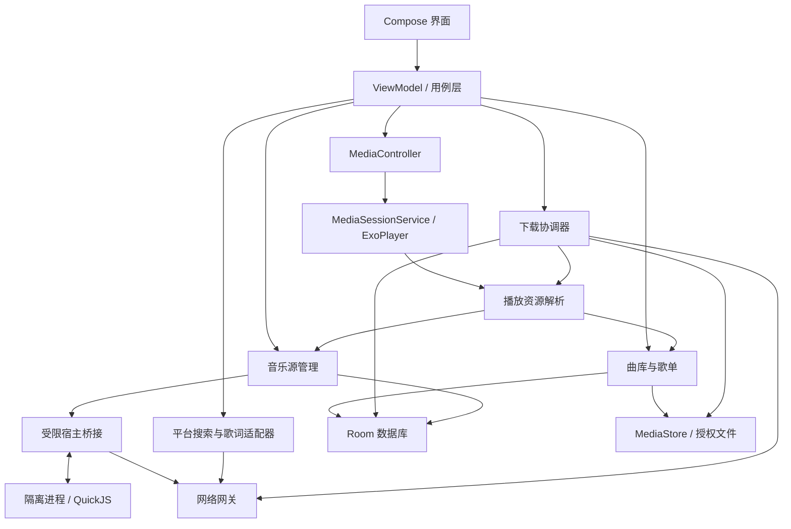

# 拾音 PickAudio v1.0 详细设计文档

文档日期：2026 年 9 月 17 日  
产品名称：暂沿用项目目录名称“拾音 PickAudio”  
文档用途：作为产品交互、Android 开发、测试验收的共同依据。

## 一、产品定位与设计范围

### 1.1 产品目标

开发一款供自己和少量朋友使用的 Android 音乐播放器，以 APK 安装包交付。

核心体验是：**导入本地歌曲、用歌单整理音乐、稳定后台播放，以及通过用户导入的 LX 自定义源实现在线歌曲播放和下载。**

不依赖自建服务器，不要求注册账号。断网时，本地曲库、歌单管理和已下载歌曲播放保持可用。

### 1.2 已确认的产品决策

| 项目 | 第一版设计 |
|---|---|
| 系统范围 | 只以 Android 16 为支持和验收范围 |
| 使用人群 | 自己和少量朋友 |
| 曲库规模 | 按 1 万首歌曲设计 |
| 本地导入 | 扫描手机音频，或手动选择文件、目录；引用原文件 |
| 歌曲组织 | 歌单分组，同一首歌曲可加入多个歌单 |
| 播放模式 | 顺序播放、列表循环、单曲循环、随机播放 |
| 在线搜索 | 内置网易云、QQ 音乐搜索适配 |
| 音乐源 | 用户导入 LX 自定义源脚本或脚本链接 |
| 在线收听 | 搜索后直接播放，也可主动下载 |
| 默认音质 | 在线播放 128k，下载 320k；支持选择可用的无损档位 |
| 下载位置 | 公共音乐目录 `Music/PickAudio` |
| 歌词 | 应用内按行同步，支持本地 LRC、在线歌词、偏移校准 |
| 日常功能 | 收藏、播放队列、睡眠定时、进度恢复、锁屏和耳机控制 |
| 界面风格 | 简洁原生风格，支持浅色、深色及跟随系统 |
| 数据迁移 | 无账号，本地导出和导入备份；歌曲文件另行迁移 |

### 1.3 第一版边界

第一版不包含云同步、平台账号登录、在线歌单导入、推荐信息流、评论社区、桌面悬浮歌词、逐字歌词、均衡器、淡入淡出、投屏及车载专用界面。

**在线能力需要分别验证搜索接口与音乐源。** LX 移动版自定义源以播放地址解析为核心，网易云、QQ 对应的标准源能力不负责歌曲搜索；本设计将搜索和在线歌词放在平台适配器中实现。([lxmusic.toside.cn](https://lxmusic.toside.cn/mobile/custom-source))

第一版兼容目标是符合 LX **移动版**接口约定的脚本，不承诺所有名为“LX 音源”的脚本都可直接运行。

---

## 二、功能与交互设计

### 2.1 页面结构

底部导航设置三个入口：**曲库、歌单、搜索**。下载管理和设置通过顶部图标进入。

存在播放队列时，在底部导航上方显示迷你播放器。

| 页面 | 内容 | 主要操作 |
|---|---|---|
| 曲库 | 本地歌曲、歌手、专辑、已下载歌曲 | 导入、搜索、排序、多选、播放 |
| 歌单 | 我喜欢、用户创建的歌单 | 新建、重命名、排序、删除 |
| 歌单详情 | 封面、名称、歌曲数量、歌曲列表 | 播放全部、随机播放、添加歌曲、手动排序 |
| 搜索 | 搜索框、历史记录、平台切换、结果列表 | 在线播放、加入歌单、下一首播放、下载 |
| 正在播放 | 封面或歌词、歌曲信息、进度及播放控制 | 切歌、收藏、音质、队列、睡眠定时 |
| 下载管理 | 下载中、已完成、失败或待处理任务 | 暂停、继续、取消、重试、查看文件 |
| 音乐源管理 | 已导入脚本、平台能力、音质及运行状态 | 导入、测试、选择、更新、删除 |
| 设置 | 外观、扫描规则、音质、缓存、备份、诊断 | 修改设置、清理缓存、导入导出 |

界面设计默认使用系统字体、Material 3 组件和单一强调色。歌曲列表采用扁平布局；标题、歌手、时长和来源标识保持清晰。主要操作触控区域按至少 48dp 设计，支持系统字体放大和 TalkBack。

### 2.2 首次启动

首次启动直接进入曲库，提供“扫描手机歌曲”和“选择文件”两个入口。

不集中索取所有权限：

1. 点击扫描时申请音频读取权限。
2. 选择文件或目录时打开系统选择器。
3. 首次进入在线功能时提示可在音乐源管理中导入脚本。
4. 首次下载时介绍保存位置和通知用途。

拒绝扫描权限后，仍可通过系统文件选择器导入歌曲。

### 2.3 本地歌曲导入

**导入方式**

- 扫描系统音频库。
- 选择一个或多个音频文件。
- 授权一个目录，递归导入其中的音频文件。

扫描通过 `MediaStore` 实现；文件和目录选择使用 Storage Access Framework，并保存系统允许持久化的 URI 授权。目录访问仅限系统允许用户选择的范围。([developer.android.com](https://developer.android.com/training/data-storage/shared/media))

**扫描规则**

- 自动扫描默认排除小于 30 秒的音频，设置中可关闭。
- 手动选择的文件不受时长过滤。
- 首次扫描建立索引，后续增量检查新增、修改和失效文件。
- 元数据解析在后台分批执行；已完成索引的歌曲立即可用。
- 专辑封面按需加载，不在扫描阶段将全部封面载入内存。

验收样本覆盖 MP3、AAC/M4A、FLAC、WAV、Ogg；不支持的编码变体显示明确原因。

**歌曲信息**

读取标题、歌手、专辑、时长、曲目序号、格式、文件大小和封面。缺少标题时使用文件名，缺少歌手或专辑时显示“未知歌手”“未知专辑”。

**重复与失效处理**

- 同一系统媒体记录、相同文件 URI 的重复导入执行更新，不重复创建歌曲。
- 不仅凭“歌名＋歌手”合并歌曲，保留现场版、重制版及不同文件版本。
- 不同访问方式指向疑似同一文件时，先验证文件身份，再合并引用。
- 文件不存在与权限失效分别标记，提供“重新定位”和“重新授权”操作。
- 扫描中断或权限被撤销时，不把整批未读取文件误判为已删除。

### 2.4 歌单与收藏

歌单支持新建、重命名、删除、批量添加、批量移除及拖动排序。

规则如下：

- 同一首歌可属于多个歌单。
- 同一歌单内不重复添加相同歌曲记录。
- 歌单可混合本地歌曲和在线歌曲。
- 默认按添加顺序排列，也可按歌名、歌手排序。
- 拖动排序进入手动顺序，并持久保存。
- 删除歌单只删除组织关系，不删除音频文件。
- “我喜欢”是固定收藏列表，不能删除或重命名。

在线歌曲下载完成后，原歌单和收藏关系继续保留，关联到同一歌曲的本地副本。

### 2.5 播放模式和队列

| 模式 | 自动切歌规则 |
|---|---|
| 顺序播放 | 按队列顺序播放，到最后一首结束后停止 |
| 列表循环 | 播放到队列末尾后回到第一首 |
| 单曲循环 | 当前歌曲结束后重新播放 |
| 随机播放 | 每轮生成随机顺序，同一轮不重复；整轮结束后重新随机 |

补充规则：

- 单曲循环只影响自然播放结束，手动“下一首”仍切换歌曲。
- 随机模式下，“上一首”按实际播放历史返回。
- 当前进度超过 3 秒时，“上一首”先回到本曲开头；否则切到上一首。
- 连续两轮随机播放尽量避免首尾立即重复；只有一首歌曲时允许重复。

**队列操作**

支持下一首播放、添加到队尾、拖动排序、移除及清空。

从曲库或歌单点击歌曲时，以当前列表建立队列快照并从所选歌曲开始播放。搜索结果点击播放时，将该歌曲设为当前播放项，保留原有后续队列，不自动把整页搜索结果加入队列。

“下一首播放”优先于随机顺序。修改队列不改变原歌单；编辑歌单也不静默改写正在使用的队列。

移除正在播放的队列项时，切换到下一可播放项；队列为空则停止。

**异常处理**

自动切歌遇到无效文件或失效在线歌曲时跳过并记录原因。连续失败达到 3 首，或本轮所有候选项都失败时停止，避免循环请求。用户主动点击失败歌曲时展示原因，由用户选择重试、换源或跳过。

### 2.6 后台播放与进度恢复

播放对象由独立的 `MediaSessionService` 持有，界面通过 `MediaController` 控制。该结构用于支持后台播放、系统媒体控制和耳机媒体按键。([developer.android.com](https://developer.android.com/media/media3/session/background-playback))

产品行为规定为：

- 熄屏、切换应用和从最近任务划走界面时，正在进行的播放继续。
- 耳机拔出或蓝牙音频连接断开时暂停，避免突然外放。
- 因短暂音频焦点丢失而暂停，可在焦点恢复后继续；用户主动暂停后不自动恢复。
- 应用重新打开时恢复队列、歌曲、模式和进度，默认保持暂停。
- 不在手机开机后自动播放，不承诺系统强行停止后仍保持运行。
- 播放期间每 5 秒保存进度，切歌、暂停和队列修改时立即保存。

### 2.7 在线搜索与播放

**搜索交互**

提供“全部、网易云、QQ 音乐”三个筛选项。

用户提交关键词后发起请求，不在每次输入字符时访问平台。搜索历史保留最近 20 条，可逐条或全部清除。

“全部”搜索并行请求两个平台，按平台分组展示；各平台独立分页、独立显示失败状态。一方失败不隐藏另一方结果。

每条结果显示歌名、歌手、专辑、时长、平台，以及已收藏或已下载状态。不同平台的结果不自动合并。

**播放流程**

1. 检查是否存在已关联且可读取的本地副本。
2. 有本地副本则优先播放，页面标记“本地”。
3. 否则检查该平台选定的 LX 源及其声明音质。
4. 将平台歌曲标识和兼容元数据交给源解析。
5. 获取地址后开始在线播放。
6. 地址失效时允许重新解析一次，仍失败则提示用户处理。

无音乐源时仍可搜索、收藏和加入歌单，但在线播放及下载按钮引导用户选择匹配的源。

**音质规则**

在线播放默认请求 128k，下载默认请求 320k。用户可选择源声明支持的其他档位。

所选音质不存在或解析失败时，不静默标为成功，也不把普通音质显示成无损；提示用户选择其他档位。源声明音质与可检测的实际文件信息分别记录。

### 2.8 下载管理

支持单曲下载、搜索结果多选下载，以及歌单内在线歌曲的批量下载。

默认最多同时下载 2 首。下载任务明确显示等待、解析、下载、暂停、校验、完成及失败状态。

**存储规则**

下载完成后通过 `MediaStore` 发布到公共音乐目录 `Music/PickAudio`。公共媒体文件可供其他应用读取，并在卸载本应用后保留。([developer.android.com](https://developer.android.com/training/data-storage/shared/media))

文件名采用：

`歌手 - 歌名 [平台-歌曲标识-音质].扩展名`

非法字符替换为下划线，过长部分截断，文件冲突时不覆盖现有文件。扩展名依据实际媒体格式确定。

**下载过程**

1. 创建持久化任务，解析下载地址。
2. 下载到应用私有暂存文件。
3. 校验可获得的长度信息，并检查是否为可识别的音频。
4. 创建待发布的公共媒体记录并复制文件。
5. 发布媒体文件，关联曲库歌曲，更新任务为完成。
6. 清理暂存文件。

不得将 HTML 错误页、接口 JSON 或零字节响应当作歌曲保存。

暂存和发布阶段可能同时占用两份空间，空间检查应覆盖这一峰值。空间不足时暂停并说明原因。

**恢复与去重**

- 同一平台歌曲、相同音质的活动任务只允许一个。
- 已有有效下载时提示“已下载”，不重复创建文件。
- 服务器支持 Range，且资源身份可验证时续传。
- 地址更新后无法确认仍为相同资源时，从头下载，禁止拼接不同文件。
- 用户取消任务时清理未完成文件；暂停时保留。
- 清理下载历史不删除歌曲；“删除文件”作为独立操作确认。

默认允许在 Wi-Fi 下载；移动网络下载先由用户确认，并提供记住选择的设置。

### 2.9 歌词与睡眠定时

**歌词优先级**

用户手动关联的 LRC → 已授权目录内的同名 LRC → 已缓存的在线歌词 → 平台在线歌词。

自动寻找同名歌词仅限已取得目录权限的范围。只有音频读取权限时，不假定能够读取旁边的 LRC 文件。

支持：

- 按行滚动和当前行高亮。
- 点击歌词行跳转播放位置。
- 有匹配时间信息时展示翻译。
- 每首歌曲保存独立偏移，调整步长为 100 毫秒。
- 用户手动滚动后暂停自动跟随，5 秒无操作后恢复。
- 歌词缺失时保留封面和播放控件，不阻塞播放。

本地歌曲没有平台关联时，不自动根据相似歌名绑定在线歌词，避免匹配到错误版本。

**睡眠定时**

提供 15、30、45、60 分钟和自定义时长，另有“播放完当前歌曲后停止”。

定时结束时暂停并保存进度；“当前歌曲结束”优先于单曲循环。应用重启后不恢复旧定时器。

---

## 三、技术架构与数据设计

### 3.1 技术选型与取舍

| 决策 | 采用方案 | 对比与取舍 |
|---|---|---|
| 客户端技术 | Kotlin、Jetpack Compose、Material 3 | 相比跨平台方案，更直接实现本项目所需的 Android 系统能力；暂不获得 iOS 代码复用 |
| 架构形式 | 单应用内按功能分层 | 相比客户端加自建服务，部署和维护更少；平台适配更新需发版 |
| 播放框架 | Media3 ExoPlayer、MediaSession | 使用统一媒体会话处理多种控制入口；需遵循其生命周期 |
| 数据存储 | Room、DataStore | 歌曲关系使用数据库，简单设置单独保存；避免所有状态混存 |
| 网络层 | OkHttp、协程 | 所有请求经统一超时、取消和诊断管理 |
| 插件运行 | QuickJS、JNI、独立隔离进程 | 相比 WebView 脚本桥接，可明确控制宿主能力；增加原生编译和兼容测试成本 |
| 下载调度 | 用户主动发起的数据传输任务 UIDT | 针对用户下载行为实现系统任务生命周期；需自行保存和恢复下载状态 |

QuickJS 提供嵌入式 JavaScript 运行能力以及内存、执行中断等控制接口，本设计利用这些能力约束插件运行。([bellard.org](https://bellard.org/quickjs/))

Android UIDT 要求在允许的用户可见场景调度、提供任务通知，并处理系统中断；本设计不把下载视作可以无限运行的普通后台线程。([developer.android.com](https://developer.android.com/develop/background-work/background-tasks/uidt))

### 3.2 模块职责与部署结构

所有模块随同一个 APK 部署。应用侧不建设账号服务、数据库服务器或音乐中转服务器。

| 模块 | 负责的数据与行为 |
|---|---|
| 曲库 | 歌曲元数据、文件引用、扫描、文件可用状态 |
| 歌单 | 歌单、成员关系、收藏和排序 |
| 播放 | 唯一播放器实例、队列、进度、模式、系统会话 |
| 在线适配 | 搜索、歌词、封面、平台标识及元数据转换 |
| 音乐源 | 脚本文件、版本、能力、平台选择及运行实例 |
| 下载 | 下载任务、暂存文件、恢复信息及公共文件发布 |
| 备份 | 版本化导出、恢复校验和本地文件重新关联 |

各模块通过仓储或用例接口访问数据，不直接修改其他模块负责的表。

### 3.3 核心数据模型

| 实体 | 关键字段 |
|---|---|
| `Track` | ID、标题、歌手、专辑、时长、封面引用、创建时间 |
| `LocalAsset` | ID、Track ID、URI、来源类型、大小、格式、可用状态、可选文件哈希 |
| `OnlineRef` | Track ID、平台、平台歌曲 ID、版本化平台元数据 |
| `Playlist` | ID、名称、封面引用、显示顺序、创建及修改时间 |
| `PlaylistTrack` | Playlist ID、Track ID、手动顺序、加入时间 |
| `Favorite` | Track ID、收藏时间 |
| `QueueEntry` | 独立条目 ID、Track ID、队列位置 |
| `PlaybackSnapshot` | 当前条目、进度、播放模式、随机顺序、更新时间 |
| `SourceScript` | ID、名称、版本、脚本哈希、私有存储位置、能力描述、更新配置 |
| `PlatformSourceSelection` | 平台、选定 Source ID |
| `DownloadTask` | ID、OnlineRef、目标音质、状态、已下载字节、暂存位置、目标 URI、恢复校验信息 |
| `LyricRecord` | Track ID、歌词来源、内容位置、偏移、更新时间 |
| `ImportRoot` | 授权目录 URI、扫描规则、扫描状态 |
| `BackupImportRecord` | 备份标识、导入时间、处理结果 |

约束：

- `OnlineRef` 的“平台＋平台歌曲 ID”唯一。
- 同一歌单的同一 Track 关系唯一。
- 队列允许重复歌曲，依靠独立条目 ID 区分。
- 一首歌曲可关联多个本地音质副本。
- 下载完成后增加本地资源关联，不重新创建一个与原歌单无关的歌曲。
- 在线播放地址属于短期资源，不作为歌曲永久身份保存。
- 对歌单成员、平台标识、任务状态和排序字段建立索引。

### 3.4 模块接口

这些接口属于应用内部边界，第一版不开放外部 HTTP API。

| 接口 | 输入 | 输出 |
|---|---|---|
| `LibraryRepository.import` | 文件或目录 URI、导入策略 | 进度、成功/跳过/失败数量 |
| `SearchProvider.search` | 关键词、分页游标 | 歌曲描述列表、下一页游标 |
| `SearchProvider.getLyrics` | 平台歌曲标识 | 标准化歌词或缺失状态 |
| `SourceRuntime.initialize` | 脚本、兼容配置 | 平台能力、音质列表或初始化错误 |
| `SourceRuntime.resolve` | 平台歌曲信息、音质 | 媒体地址或结构化错误 |
| `PlaybackCoordinator` | 播放、暂停、切歌及队列命令 | 可观察的播放状态 |
| `DownloadRepository.enqueue` | 歌曲标识、目标音质 | 已存在或新建的任务 ID |
| `BackupService.export/import` | 系统文件 URI | 进度、校验及恢复报告 |

平台适配器必须保留 LX 所需的平台专有标识和字段，不能只返回用于显示的歌名、歌手。网易云和 QQ 的元数据转换分别以固定样例测试。

统一错误分类包括：网络不可用、超时、限流、需要认证、源未配置、脚本不兼容、解析失败、音质不可用、资源过期、文件失效、权限失效、空间不足及格式不支持。

### 3.5 状态与一致性

播放器是实时播放状态的唯一来源；数据库保存恢复快照，界面不维护第二套独立播放状态。

下载状态流为：

`等待 → 解析 → 下载 → 校验 → 发布 → 完成`

中间可进入：

`等待网络 / 等待用户处理 / 已暂停 / 失败 / 已取消`

数据库与文件发布无法组成同一个事务，因此使用持久化发布记录：

1. 保存任务及准备发布的信息。
2. 创建公共媒体记录后立即保存目标 URI。
3. 完成写入及媒体发布。
4. 在数据库事务中关联歌曲并完成任务。
5. 重启时核对“发布中”任务，继续提交或清理残留。

本项目采用单设备数据库，不存在跨服务器副本，因此不对 Room 强行套用分布式 CP/AP 分类。网络断开时本地操作继续；在线请求失败不会回滚本地歌单和收藏。

### 3.6 网络通信规则

以下数值是首版默认参数：

| 请求 | 超时及并发 | 重试规则 |
|---|---|---|
| 平台搜索、歌词 | 单次总超时 10 秒；每平台搜索并发 1 | 暂时性网络错误最多重试 1 次 |
| 插件初始化 | 总时限 15 秒 | 不自动重复初始化 |
| 插件地址解析 | 单次总时限 15 秒；播放请求优先 | 地址失效时重新解析最多 1 次 |
| 插件内部 HTTP | 总超时上限 10 秒；每脚本并发 4 | 宿主不擅自重放脚本请求 |
| 音频下载 | 连接 10 秒、连续无数据 30 秒；并发 2 | 网络错误最多重试 3 次，等待 2/4/8 秒 |
| 封面请求 | 总超时 8 秒 | 失败显示默认封面 |

认证失败和不支持的参数不自动重试；限流响应尊重服务端等待时间。

按平台或音乐源记录连续失败，连续失败 5 次后暂停自动请求 60 秒，再允许一次探测。用户主动“测试音乐源”可提前触发探测。

---

## 四、LX 兼容、Android 16 与数据管理

### 4.1 LX 插件兼容范围

支持从本地导入 UTF-8 JavaScript 文件，或从 HTTPS 地址下载脚本。第一版“订阅链接”明确指向**单个脚本文件**，不兼容未定义的合集订阅格式。

兼容 LX 移动版的基本信息、初始化/请求/更新事件、HTTP 请求、定时器，以及文档列出的 Buffer 和加密工具；不提供 Node.js、浏览器 DOM 或任意 Android 对象访问。正式能力以兼容性测试矩阵为准。([lxmusic.toside.cn](https://lxmusic.toside.cn/mobile/custom-source))

产品规则：

- 网易云、QQ 分别选择一个活动源，可以使用同一个脚本。
- 脚本声明了其他平台时显示能力信息，但首版不开放对应搜索入口。
- 不附带默认第三方音乐源。
- 支持多个脚本保存，更新前保留上一可用版本。
- 链接导入和更新先展示名称、版本、能力，再由用户启用。
- 更新失败或初始化失败时保留旧版本。
- 第一版仅手动检查更新；脚本发出的更新提示不自动安装代码。
- 仅依赖桌面环境 API 的脚本明确提示不兼容。

### 4.2 插件执行边界

插件放入独立隔离进程，网络请求通过受限宿主桥接转发。

首版限制：

- 脚本文件最大 5 MiB。
- 每个运行实例 JavaScript 堆上限 64 MiB。
- 连续同步执行超过 2 秒触发中断。
- 普通插件 HTTP 响应体上限 8 MiB。
- 不向插件提供整个曲库、备份文件、任意文件读取和设备标识。
- 阻止插件访问回环、私有网络和非 HTTP(S) 地址。
- 默认使用 HTTPS；确有需求的明文 HTTP 按源单独允许并显示标记。
- 不在不同插件间共享 Cookie 或凭证。
- 日志脱敏请求令牌、查询参数和完整带签名地址。

超时或崩溃只重启插件运行进程。正在播放的本地歌曲以及已取得地址的音频不应因插件崩溃被主动停止。

### 4.3 Android 16 适配

项目设定为：

- `minSdk = 36`
- `targetSdk = 36`
- `compileSdk = 36`
- 不设置 `maxSdkVersion`；第一版验收及支持承诺仅覆盖 Android 16。
- 发布 ARM64 APK，测试构建额外覆盖 x86_64 模拟器。

重点适配：

| 项目 | 实现要求 |
|---|---|
| 全面屏布局 | 正确处理状态栏、导航栏、键盘及播放栏 Insets |
| 返回手势 | 使用受支持的返回导航 API，正确关闭弹层、播放页和子页面 |
| 后台播放 | 声明媒体播放前台服务类型，按媒体会话生命周期运行 |
| 音频焦点 | 获得焦点后播放，失去焦点时按类型暂停或降低音量 |
| 下载任务 | 从可见用户操作调度 UIDT，保存进度和中断原因 |
| 本地访问 | MediaStore 与持久 URI 授权并用，处理授权撤回 |
| 原生库 | QuickJS/JNI 构建及依赖验证 16 KB 内存页兼容 |
| 窗口变化 | 旋转、分屏和窗口尺寸改变不重建播放器 |

Android 16 对目标 API 36 应用的全面屏布局和返回行为有明确变化，应作为验收项。([developer.android.com](https://developer.android.com/about/versions/16/behavior-changes-16))  
目标 API 35 及以上应用申请音频焦点需满足前台应用或前台服务条件。([developer.android.com](https://developer.android.com/media/optimize/audio-focus))  
包含原生库时需检查 16 KB 页大小兼容，不能只验证 APK 是否安装成功。([developer.android.com](https://developer.android.com/guide/practices/page-sizes))

### 4.4 权限设计

| 权限或授权 | 用途与申请时机 |
|---|---|
| `INTERNET`、`ACCESS_NETWORK_STATE` | 在线请求和网络状态判断 |
| `READ_MEDIA_AUDIO` | 用户选择扫描手机音频时申请 |
| 系统文件/目录 URI 授权 | 手动导入文件、目录、歌词及备份 |
| `FOREGROUND_SERVICE`、`FOREGROUND_SERVICE_MEDIA_PLAYBACK` | 后台媒体播放 |
| `RUN_USER_INITIATED_JOBS` | 用户主动发起的下载任务 |
| `POST_NOTIFICATIONS` | 在用户使用下载提醒时申请 |

媒体扫描权限和文件选择授权分别处理；写入本应用创建的公共媒体文件不额外申请旧式存储写入权限。([developer.android.com](https://developer.android.com/training/data-storage/shared/media))

不申请全盘文件管理、通讯录、定位、麦克风、电话状态及悬浮窗权限。拒绝非必要权限时，只降低相应功能，不阻止整个应用使用。

### 4.5 缓存与文件管理

| 内容 | 默认上限 | 清理策略 |
|---|---:|---|
| 在线音频缓存 | 512 MiB | 按最近最少使用淘汰，可手动清理 |
| 封面缓存 | 100 MiB | 自动淘汰 |
| 自动获取的歌词缓存 | 20 MiB | 自动淘汰 |
| 诊断日志 | 10 MiB / 最近 7 天 | 滚动删除 |

播放缓存与正式下载分开管理。清理缓存不删除下载文件、用户手动导入的歌词、歌单或收藏。

缓存片段不标记为“已下载”，不承诺缓存歌曲一定能离线完整播放。

### 4.6 本地备份与恢复

备份格式采用带版本号的 ZIP，内含 JSON 清单和用户导入的歌词等小型数据。

**备份内容**

- 歌单、歌曲关系和手动顺序。
- 收藏、歌曲描述和在线平台标识。
- 外观、默认音质等非敏感设置。
- 歌词关联信息和偏移。
- 本地歌曲重新关联所需的文件描述及已有哈希。
- 音乐源名称和脚本哈希等识别信息。

**不包含**

音频文件、缓存、未完成下载、短期播放地址、认证凭证和音乐源可执行脚本。换机后重新导入源脚本，不从备份中自动执行代码。

恢复采用合并方式：

- 不删除现有曲库和歌单。
- 相同在线平台标识复用歌曲记录。
- 歌单 ID 冲突且内容不同则另建“原名称（恢复）”。
- 相同备份重复导入不重复创建内容。
- 本地歌曲先恢复占位记录，再扫描和重新关联。
- 文件哈希一致可自动关联；只有名称、时长相似时交由用户确认。
- 不把旧手机的 URI 当作新手机上的有效授权。

备份导入前校验格式版本、校验和、解压路径和大小；未来不支持的格式拒绝导入。一次恢复的数据写入使用事务，失败时保留导入前状态。

---

## 五、实施顺序、验收与交付

### 5.1 实施阶段

| 阶段 | 工作内容 | 完成条件 |
|---|---|---|
| M0：关键能力验证 | 两个平台搜索、LX 脚本运行、歌曲标识转换、解析、歌词、下载样例 | 真实链路及兼容矩阵完成，不以假数据代替在线验证 |
| M1：本地播放器 | 页面骨架、导入、曲库、歌单、四种模式、后台播放 | 完整离线使用流程通过 |
| M2：在线功能 | 搜索、音乐源管理、在线播放、歌词、下载恢复 | 两个平台分别通过搜索至离线播放验收 |
| M3：日常体验 | 收藏、睡眠定时、缓存、备份、异常反馈 | 页面状态与恢复行为完整 |
| M4：发布验证 | 万首曲库、Android 16 真机、16 KB 页大小、稳定性及升级 | 生成签名 APK、测试报告和安装说明 |

M0 是在线功能的交付门槛。目前已核对接口设计依据，但尚未运行真实搜索接口、源脚本或 APK。若平台或音乐源不可用，应记录阻塞项，不将该能力标记为已完成。

### 5.2 核心功能验收

| 场景 | 预期结果 |
|---|---|
| 扫描后再次导入同一文件 | 不重复创建歌曲 |
| 拒绝扫描权限 | 仍可手动选择文件播放 |
| 文件移动或目录授权撤回 | 保留歌单关系，提示重新定位或授权 |
| 歌曲加入多个歌单 | 各歌单排序独立 |
| 删除歌单 | 音频文件保留 |
| 顺序播放到末尾 | 停止，不自动回到开头 |
| 单曲循环时按下一首 | 正常切换 |
| 随机播放一整轮 | 无非预期重复，上一首与历史一致 |
| 熄屏连续播放 2 小时 | 无应用自身引起的中断 |
| 耳机断开 | 暂停，不突然外放 |
| 进程重建 | 恢复队列和进度，默认不自动出声 |
| 单个平台搜索失败 | 另一个平台结果可用 |
| 无音乐源 | 可搜索和收藏，播放时引导配置 |
| 脚本死循环、超时或崩溃 | 能终止运行，主界面与本地播放正常 |
| 源只支持部分音质 | 只显示对应能力，失败时不伪装为高音质成功 |
| 返回 HTML、JSON 或空文件 | 下载失败，不发布到公共音乐目录 |
| 下载中断后资源改变 | 重新下载，不拼接错误内容 |
| 发布文件过程中进程退出 | 恢复后无重复文件、无错误完成状态 |
| 空间不足 | 暂停任务，保留明确恢复入口 |
| 清理缓存 | 正式下载和用户数据保留 |
| 换机恢复备份 | 歌单、收藏恢复，缺失文件可重新关联 |
| 重复导入同一备份 | 不重复生成歌单和成员 |

自动化测试重点覆盖播放模式、队列操作、歌词时间轴、插件协议桥接、下载状态机、数据库迁移及备份合并。平台真实接口测试独立运行，避免外部服务波动导致所有本地测试不可用。

### 5.3 性能目标

以下是待测目标，不是已实现结果。基准条件为 Android 16、ARM64、8 GB 内存真机、发布构建及 1 万首索引歌曲。

| 指标 | 目标 |
|---|---|
| 冷启动至可操作界面 | P95 ≤ 2 秒 |
| 本地歌曲搜索 | P95 ≤ 200 毫秒 |
| 打开歌单首屏 | P95 ≤ 300 毫秒 |
| 点击本地歌曲至开始出声 | P95 ≤ 500 毫秒 |
| 滚动万首歌曲列表 | 分页加载，无持续卡顿或 ANR |
| 扫描时操作界面 | 保持可响应，可取消扫描 |
| 播放页歌词跟随 | 根据播放器时间更新，避免重组整个页面 |
| 长时间播放及切歌 | 无持续内存增长 |
| 在线播放等待 | 分别记录搜索、解析、缓冲耗时，不以总耗时掩盖失败阶段 |

网络性能使用受控网络和固定测试资源验收；真实第三方源的波动另外记录。

### 5.4 风险登记与处理

| 风险 | 影响 | 处理方式 | 责任模块 / 复核阶段 |
|---|---|---|---|
| 平台搜索或歌词接口变化 | 在线结果或歌词不可用 | 独立适配器、固定响应样例、真实链路测试 | 在线适配 / M0、发版前 |
| LX 脚本依赖未支持能力 | 源导入后无法运行 | 明确移动版兼容矩阵，失败时提示具体能力 | 插件运行 / M0、M2 |
| 播放地址短期有效 | 播放或续传中断 | 临用前解析、受控重新解析、恢复时验证资源身份 | 播放与下载 / M2 |
| 系统回收或停止进程 | 任务和播放中断 | 持久化状态、恢复扫描、遵循系统停止语义 | 系统集成 / M4 |
| 公共文件与数据库提交不同步 | 孤立文件或错误完成状态 | 发布记录与启动恢复核对 | 下载 / M2 |
| 换机后 URI 失效 | 歌单中的本地歌曲不可播放 | 占位恢复、重新授权及文件匹配 | 备份 / M3 |
| 第三方脚本异常 | 卡顿、资源消耗或越权访问 | 隔离进程、受限桥接、内存与执行时限 | 插件运行 / M0、M4 |

### 5.5 发布与维护

交付内容包括：

- 完整项目源码及构建说明。
- Android 16 ARM64 签名 APK。
- 本设计文档和音乐源兼容矩阵。
- 本地、在线及异常场景测试报告。
- 安装、导入音乐源、备份恢复的简明说明。
- 依赖版本锁定清单及第三方许可说明。

升级沿用同一应用 ID 和签名证书；数据库采用显式迁移，禁止通过清空数据处理升级失败。

第一版通过手动安装 APK 更新，不内置自动更新服务。不默认上传日志或行为数据；用户可主动导出脱敏诊断报告。

**设计结论：产品范围与架构已确定，可据此进入实现；在线能力需通过 M0 的真实接口与源脚本验证后，才能认定具备交付条件。**
